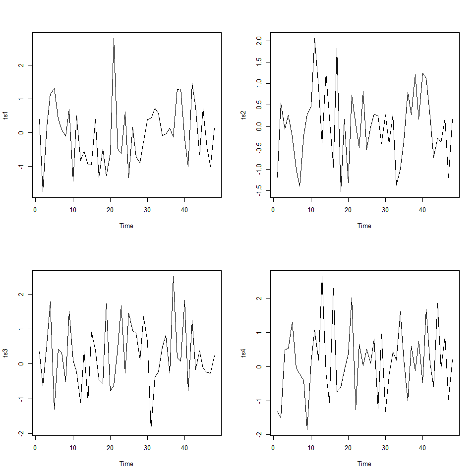

Homework-1
================
Sonya Hua
September 25, 2017

### Question 1.

Create a vector for the following data set and provide mean, std dev: 27, 30, 33, 36, 39, 42, 45, 48, 51, and 5

``` r
x <- c(27, 30, 33, 36, 39, 42, 45, 48, 51, 5)

print(paste("The standard deviation is: ", sd(x)))
```

    ## [1] "The standard deviation is:  13.251415018782"

``` r
print(paste("The mean of vector x is: ", mean(x)))
```

    ## [1] "The mean of vector x is:  35.6"

### Question 2

a). Create a numeric vector x of length 80 that ranges from −pi to pi b). Create a vector y1 that is the sine of x (in radians) c). Create a vector y2 that is the cosine of x (in radians) d). Plot y1 vs. x as a series of points joined by lines. On the same graph, add red-colored points for y2 vs x.

``` r
# a) 
(x <- seq(-pi,pi,length=80))
```

    ##  [1] -3.1415927 -3.0620587 -2.9825247 -2.9029907 -2.8234567 -2.7439227
    ##  [7] -2.6643887 -2.5848547 -2.5053207 -2.4257867 -2.3462527 -2.2667188
    ## [13] -2.1871848 -2.1076508 -2.0281168 -1.9485828 -1.8690488 -1.7895148
    ## [19] -1.7099808 -1.6304468 -1.5509128 -1.4713788 -1.3918448 -1.3123109
    ## [25] -1.2327769 -1.1532429 -1.0737089 -0.9941749 -0.9146409 -0.8351069
    ## [31] -0.7555729 -0.6760389 -0.5965049 -0.5169709 -0.4374370 -0.3579030
    ## [37] -0.2783690 -0.1988350 -0.1193010 -0.0397670  0.0397670  0.1193010
    ## [43]  0.1988350  0.2783690  0.3579030  0.4374370  0.5169709  0.5965049
    ## [49]  0.6760389  0.7555729  0.8351069  0.9146409  0.9941749  1.0737089
    ## [55]  1.1532429  1.2327769  1.3123109  1.3918448  1.4713788  1.5509128
    ## [61]  1.6304468  1.7099808  1.7895148  1.8690488  1.9485828  2.0281168
    ## [67]  2.1076508  2.1871848  2.2667188  2.3462527  2.4257867  2.5053207
    ## [73]  2.5848547  2.6643887  2.7439227  2.8234567  2.9029907  2.9825247
    ## [79]  3.0620587  3.1415927

``` r
# b)
(y1 <- sin(x))
```

    ##  [1] -1.224606e-16 -7.945017e-02 -1.583980e-01 -2.363444e-01 -3.127966e-01
    ##  [6] -3.872712e-01 -4.592973e-01 -5.284196e-01 -5.942010e-01 -6.562257e-01
    ## [11] -7.141016e-01 -7.674627e-01 -8.159716e-01 -8.593217e-01 -8.972389e-01
    ## [16] -9.294834e-01 -9.558515e-01 -9.761763e-01 -9.903295e-01 -9.982214e-01
    ## [21] -9.998023e-01 -9.950622e-01 -9.840309e-01 -9.667782e-01 -9.434133e-01
    ## [26] -9.140838e-01 -8.789752e-01 -8.383094e-01 -7.923436e-01 -7.413683e-01
    ## [31] -6.857058e-01 -6.257081e-01 -5.617544e-01 -4.942492e-01 -4.236191e-01
    ## [36] -3.503108e-01 -2.747878e-01 -1.975274e-01 -1.190182e-01 -3.975652e-02
    ## [41]  3.975652e-02  1.190182e-01  1.975274e-01  2.747878e-01  3.503108e-01
    ## [46]  4.236191e-01  4.942492e-01  5.617544e-01  6.257081e-01  6.857058e-01
    ## [51]  7.413683e-01  7.923436e-01  8.383094e-01  8.789752e-01  9.140838e-01
    ## [56]  9.434133e-01  9.667782e-01  9.840309e-01  9.950622e-01  9.998023e-01
    ## [61]  9.982214e-01  9.903295e-01  9.761763e-01  9.558515e-01  9.294834e-01
    ## [66]  8.972389e-01  8.593217e-01  8.159716e-01  7.674627e-01  7.141016e-01
    ## [71]  6.562257e-01  5.942010e-01  5.284196e-01  4.592973e-01  3.872712e-01
    ## [76]  3.127966e-01  2.363444e-01  1.583980e-01  7.945017e-02  1.224606e-16

``` r
# c)
(y2 <- cos(x))
```

    ##  [1] -1.00000000 -0.99683884 -0.98737534 -0.97166934 -0.94982013
    ##  [6] -0.92196585 -0.88828261 -0.84898336 -0.80431657 -0.75456462
    ## [11] -0.70004207 -0.64109364 -0.57809200 -0.51143548 -0.44154550
    ## [16] -0.36886392 -0.29385027 -0.21697881 -0.13873553 -0.05961513
    ## [21]  0.01988219  0.09925380  0.17799790  0.25561663  0.33161928
    ## [26]  0.40552532  0.47686750  0.54519477  0.61007515  0.67109843
    ## [31]  0.72787881  0.78005731  0.82730403  0.86932027  0.90584039
    ## [36]  0.93663350  0.96150490  0.98029737  0.99289207  0.99920940
    ## [41]  0.99920940  0.99289207  0.98029737  0.96150490  0.93663350
    ## [46]  0.90584039  0.86932027  0.82730403  0.78005731  0.72787881
    ## [51]  0.67109843  0.61007515  0.54519477  0.47686750  0.40552532
    ## [56]  0.33161928  0.25561663  0.17799790  0.09925380  0.01988219
    ## [61] -0.05961513 -0.13873553 -0.21697881 -0.29385027 -0.36886392
    ## [66] -0.44154550 -0.51143548 -0.57809200 -0.64109364 -0.70004207
    ## [71] -0.75456462 -0.80431657 -0.84898336 -0.88828261 -0.92196585
    ## [76] -0.94982013 -0.97166934 -0.98737534 -0.99683884 -1.00000000

``` r
# d)  Plot y1 vs. x as a series of points joined by lines. 
# On the same graph, add red-colored points for y2 vs x.
par(mfrow=c(1,1)) 
plot(y1, x, type="b")
lines(y2,x, type="p", col="red")
```


### Question 3

a). Simulate a completely random process of length 48 with independent normal values. Repeat this exercise three more times with a new simulation each time.

b). Draw the four time series in a 2-by-2 layout

``` r
# a)
set.seed(3856)
ts1 <- rnorm(n=48)

set.seed(2345)
ts2 <- rnorm(n=48)

set.seed(9987)
ts3 <- rnorm(n=48)

set.seed(96387)
ts4 <- rnorm(n=48)
```

``` r
par(mfrow=c(2,2))
plot.ts(ts1)
plot.ts(ts2)
plot.ts(ts3)
plot.ts(ts4)
```


